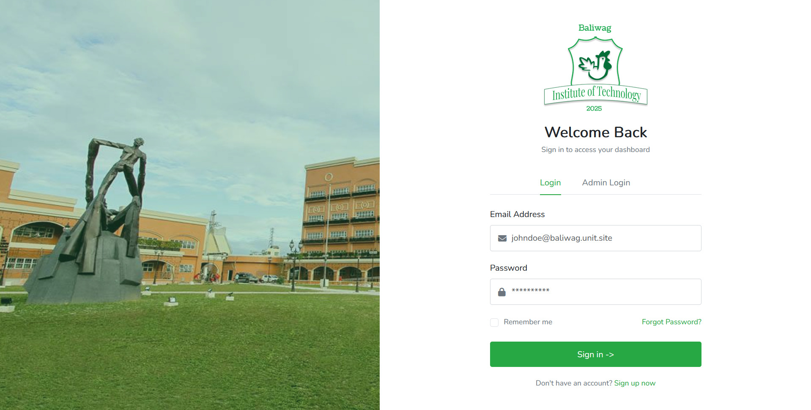
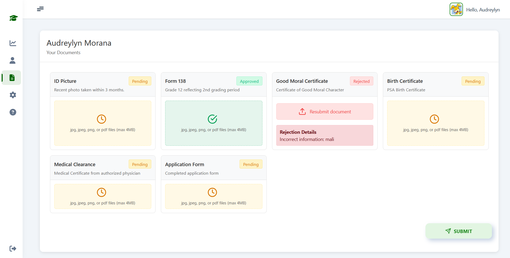
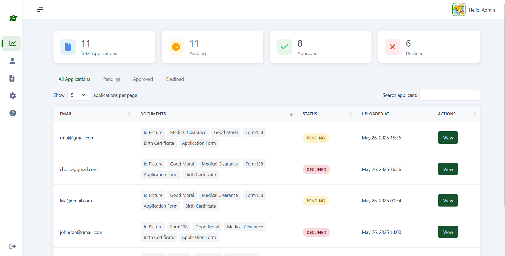
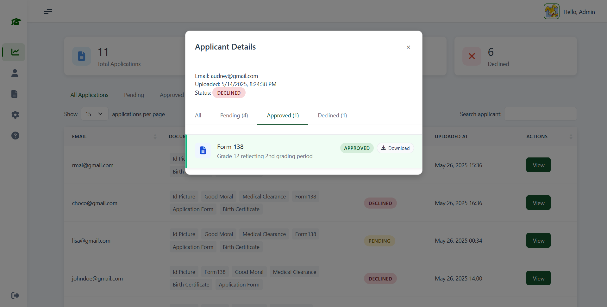
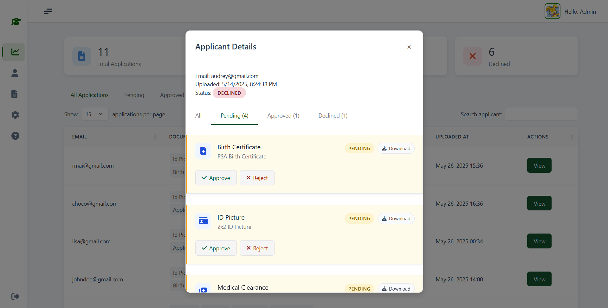
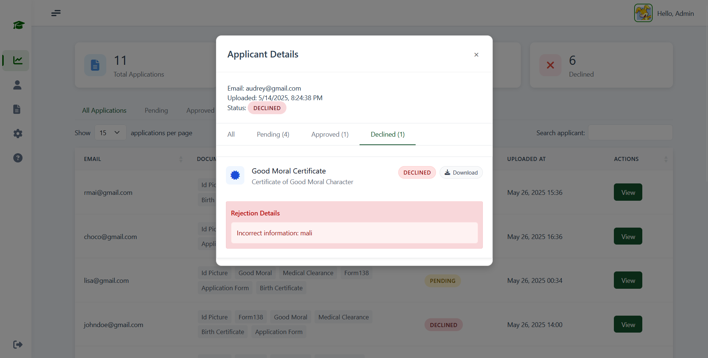

# 📄 Document Verification System

## Overview

A web-based platform for academic institutions to manage, verify, and track applicant document submissions. **This repository contains only the Document Upload module**—a standalone component focused on secure document submission and verification. This project was developed for the Software Development subject. The system streamlines the document review process for both applicants and administrators, ensuring secure, efficient, and transparent verification.  
**Target Users:** Applicants (students), Admins (registrars/staff).

---

## 📌 Key Features

-   🚀 Role-based dashboards for applicants and admins
-   🛠️ Dynamic file upload with real-time progress and status badges
-   🔄 AJAX-powered form submissions for seamless UX
-   📊 Interactive admin tables with filtering and sorting
-   🎨 Responsive UI using Tailwind CSS and Bootstrap
-   🗂️ Custom status indicators for document approval, pending, and rejection
-   🔔 Real-time feedback and error handling

---

## 🛠️ Technologies Used

| Area     | Technology / Library  | Link                                                             |
| -------- | --------------------- | ---------------------------------------------------------------- |
| Backend  | Laravel 12 (PHP 8.2+) | [Laravel](https://laravel.com/)                                  |
| Frontend | Tailwind CSS 4        | [Tailwind CSS](https://tailwindcss.com/)                         |
|          | Bootstrap 5           | [Bootstrap](https://getbootstrap.com/)                           |
|          | Font Awesome 6        | [Font Awesome](https://fontawesome.com/)                         |
|          | Vite (build tool)     | [Vite](https://vitejs.dev/)                                      |
|          | Axios                 | [Axios](https://axios-http.com/)                                 |
|          | DataTables            | [DataTables](https://datatables.net/)                            |
|          | jQuery                | [jQuery](https://jquery.com/)                                    |
| Fonts    | Nunito                | [Nunito](https://fonts.google.com/specimen/Nunito)               |
|          | Instrument Sans       | [Instrument Sans](https://fonts.bunny.net/fonts/instrument-sans) |

---

## 🔐 Security Features

-   Session management using Laravel's built-in mechanisms
-   Authentication & authorization with Laravel guards
-   Password hashing via [bcrypt](https://laravel.com/docs/12.x/hashing)
-   Input validation on both client and server sides
-   CSRF protection for all forms
-   Rate limiting for sensitive endpoints

---

## 👥 User Roles & Responsibilities

### Applicant

-   Upload required documents (ID, Form 138, etc.)
-   Track document status (approved, pending, rejected)
-   View feedback and resubmit if needed

### Admin

-   Review and approve/reject applicant documents
-   Manage application statuses
-   Filter and search applications
-   Provide feedback on rejected documents

---

## 🖼️ Screenshots

### Log In Page

### Applicant Upload

### Applicant List (Admin View)

### Approved Document View

### Pending Document View

### Rejected Document View

---

## 📜 License & Credits

This project is for academic use and educational purposes only.  
It uses open-source libraries in compliance with their respective licenses.

---

## 👤 Author

**Audreylyn Moraña**  
Front End Lead  
Email: [audreylynmorana1504@gmail.com](mailto:audreylynmorana1504@gmail.com)

---
